# Goal

Simple banking application model using Domain Driven Design.
The app accounts for authorization and management of accounts.
Accounts can perform transfers to other accounts.

# Context diagrams

- All value objects are immutable and do not contain identifiers.
- Value objects are represented with rounded-corner boxes and have underlined names.
- All entities and aggregate roots contain unique identifiers.
- Entities and aggregate roots are represented with sharp-corner boxes.
- All dates and datetimes are in UTC.

## Authorization context

Property | Restriction
---|---
username | 1-63 characters, regex `^[a-zA-Z0-9 ]$`
email | 1-127 characters, regex `^[\w\-\.]+@([\w-]+\.)+[\w-]{2,}$`
password hash | 256 bytes
password salt | 256 bytes
started at | Less than `expires at`
expires at | Greater than `started at`, greater than now
session token | 512 bytes
refresh token | 512 bytes
IP address | 128 bytes
HTTP Agent | 0-255 characters
HTTP Version | `1.0`, `1.1`, `2.0` or `3.0`

## Account management context

Property | Restriction
---|---
email | 1-127 characters, regex `^[\w\-\.]+@([\w-]+\.)+[\w-]{2,}$`
country prefix | Enum of country prefixes
telephone number | 9 characters, regex `^[0-9]{9}$`
country | Enum of countries
zip code | 5 characters, regex `^[0-9]{5}$`
city | 1-255 characters, regex `^[a-zA-Z ]{1, 255}$`
street name | 1-255 characters, regex `^[a-zA-Z ]{1, 255}$`
street number 1 | 1-255 characters, regex `^[a-zA-Z0-9 ]{1, 255}$`
street number 2 | 0-255 characters, regex `^[a-zA-Z0-9 ]{0, 255}$`
first name | 1-255 characters, regex `^[a-zA-Z]{1, 255}$`
second name | 0-255 characters, regex `^[a-zA-Z ]{0, 255}$`
surname | 1-255 characters, regex `^[a-zA-Z]{1, 255}$`
sex | `male`, `female` or `other`
account number | 17 characters, regex `^[0-9]{17}$`
account name | 1-63 characters, regex `^[a-zA-Z0-9 ]{1, 63}$`
account type | `Checking`, `Savings`, etc.

## Transfer context

Property | Restriction
---|---
amount | Positive integer
completed at | Optional, greater than `requested at`
account number | 17 characters, regex `^[0-9]{17}$`
saldo | Non-negative integer
