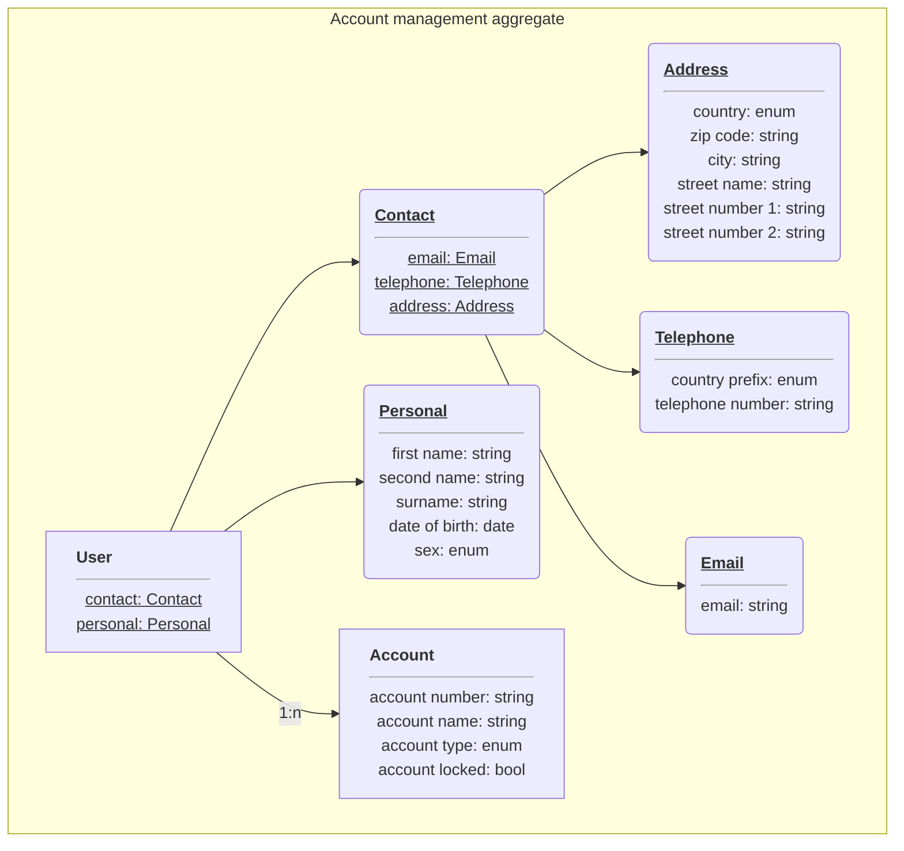

```mermaid
flowchart TD
    classDef align_left text-align:left

    subgraph Account management aggregate
        user[
            <b>User</b>
            <hr><u>contact: Contact</u>
            <u>personal: Personal</u>
        ]:::align_left

        contact(
            <b><u>Contact</u></b>
            <hr><u>email: Email</u>
            <u>telephone: Telephone</u>
            <u>address: Address</u>
        ):::align_left

        email(
            <b><u>Email</u></b>
            <hr>email: string
        ):::align_left

        phone(
            <b><u>Telephone</u></b>
            <hr>country prefix: enum
            telephone number: string
        ):::align_left

        address(
            <b><u>Address</u></b>
            <hr>country: enum
            zip code: string
            city: string
            street name: string
            street number 1: string
            street number 2: string
        ):::align_left

        personal(
            <b><u>Personal</u></b>
            <hr>first name: string
            second name: string
            surname: string
            date of birth: date
            sex: enum
        ):::align_left

        account[
            <b>Account</b>
            <hr>account number: string
            account name: string
            account type: enum
            account locked: bool
        ]:::align_left


        user --> contact
        contact --> address
        contact --> phone
        contact --> email
        user --> personal
        user -- 1:n --> account
    end
```
