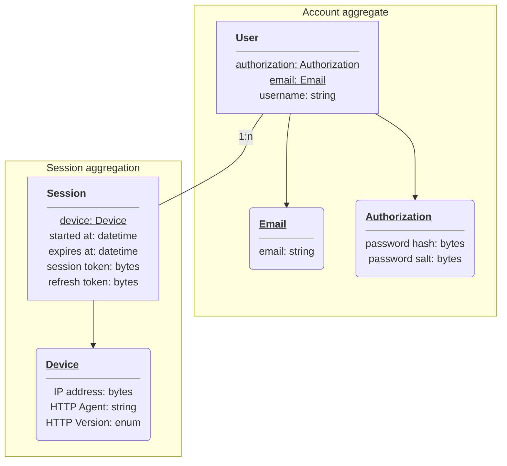

```mermaid
flowchart TD
    classDef align_left text-align:left

    subgraph Account aggregate
        user[
            <b>User</b>
            <hr><u>authorization: Authorization</u>
            <u>email: Email</u>
            username: string
        ]:::align_left

        email(
            <b><u>Email</u></b>
            <hr>email: string
        ):::align_left

        auth(
            <b><u>Authorization</u></b>
            <hr>password hash: bytes
            password salt: bytes
        ):::align_left

        user --> auth
        user --> email
    end

    subgraph Session aggregation
        session[
            <b>Session</b>
            <hr><u>device: Device</u>
            started at: datetime
            expires at: datetime
            session token: bytes
            refresh token: bytes
        ]:::align_left

        device(
            <b><u>Device</u></b>
            <hr>IP address: bytes
            HTTP Agent: string
            HTTP Version: enum
        ):::align_left

        session --> device
    end

    user -- 1:n --- session
```
