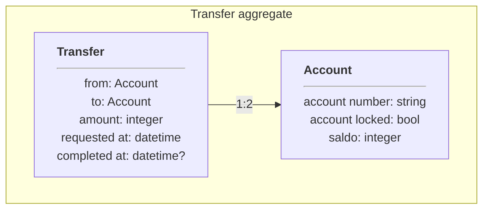

```mermaid
flowchart TD
    classDef align_left text-align:left

    subgraph Transfer aggregate
        transfer[
            <b>Transfer</b>
            <hr>from: Account
            to: Account
            amount: integer
            requested at: datetime
            completed at: datetime?
        ]:::align_left

        account[
            <b>Account</b>
            <hr>account number: string
            account locked: bool
            saldo: integer
        ]:::align_left

        transfer -- 1:2 --> account
    end
```
